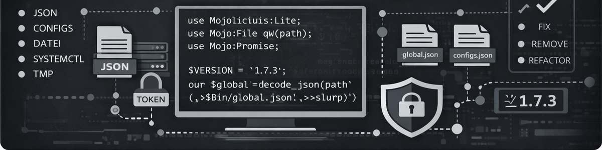

# Config Manager REST API

  

Eine robuste, systemnahe REST API zur **kontrollierten Verwaltung von Konfigurationsdateien** auf Servern.
Das Projekt richtet sich an Administratoren, Automations-Loesungen und technische Plattformen, die Konfigurationen zentral lesen, schreiben und versionieren muessen, ohne ein Web-UI oder interaktive Bedienung.

Der Fokus liegt bewusst auf:
- technischer Klarheit
- sicherem Default-Verhalten
- nachvollziehbaren Aktionen
- stabiler Integration in bestehende Systeme

Kein UI. Kein Framework-Zirkus. Reine API.

---

## Motivation

In vielen Umgebungen werden Konfigurationsdateien weiterhin direkt auf dem System gepflegt, waehrend Steuerung, Deployment und Monitoring extern stattfinden.
Diese API schliesst genau diese Luecke.

Sie ermoeglicht:
- kontrollierten Remote-Zugriff auf Konfigurationsdateien
- reproduzierbare Aenderungen ueber HTTP
- saubere Integration in CI/CD, Orchestrierung und Admin-Tools
- klare Trennung zwischen Steuerung und Ausfuehrung

---

## Eigenschaften

- Reine REST API (JSON)
- Lesen und Schreiben von Konfigurationsdateien
- Definierte Aktionen pro Konfiguration
- Optionaler Backup-Mechanismus
- Sauberes Fehler- und Statusmodell
- Systemnahe Ausfuehrung (systemctl, Scripts)
- Kein Zustand im Serverprozess

---

## Architektur

- Sprache: Perl
- Framework: Mojolicious::Lite
- API-Stil: REST, JSON
- Nebenlaeufigkeit: Mojo::IOLoop + Subprocess
- Logging: Mojo::Log
- Laufzeit: systemd, VM oder Container

Die API ist zustandslos und blockiert keine Worker bei Systemoperationen.

---

## Sicherheit

Sicherheit ist kein Add-on, sondern Grundannahme:

- IP-basierte Zugriffskontrolle (CIDR)
- Optionaler API-Token (Header oder Bearer)
- Strikte Pfad-Kanonisierung
- Kein Directory Traversal
- Keine Symlink-Folgen
- Whitelist-basierte Aktionen
- Keine impliziten Defaults

Alle sicherheitsrelevanten Ereignisse werden geloggt.

---

## Typische Einsatzszenarien

- Zentrale Verwaltung von Service-Konfigurationen
- Steuerung von systemd-Services ueber API
- Automatisierte Konfig-Aenderungen in CI/CD
- Backup und Restore von Konfigurationsdateien
- Integration in eigene Admin-Frontends
- Betrieb in abgeschotteten Management-Netzen

---

## Installation

~~~bash
git clone https://github.com/hec1976/config-manager-rest-api.git
cd config-manager-rest-api
chmod +x config-manager-agent.pl
~~~

Abhaengigkeiten installieren:

~~~bash
cpanm Mojolicious
~~~

---

## Betrieb

Die API wird als normaler Prozess gestartet und laesst sich problemlos als systemd-Service betreiben.

~~~bash
./config-manager-agent.pl
~~~

Nach dem Start stellt die API ihre Endpunkte ueber HTTP bereit.

---

## Schnittstelle

Die API stellt ausschliesslich JSON-Endpunkte bereit.
Alle Antworten sind explizit und maschinenlesbar.

Typische Operationen:
- Auflisten verfuegbarer Konfigurationen
- Lesen einer Konfiguration
- Schreiben einer Konfiguration
- Ausfuehren definierter Aktionen
- Auflisten und Wiederherstellen von Backups
- Health-Check

Die konkrete Auspraegung erfolgt bewusst konfigurationsgetrieben und ist nicht Teil dieser README.

---

## Logging und Nachvollziehbarkeit

- Jeder Request erhaelt eine Request-ID
- Laufzeiten werden gemessen
- Rueckgabecodes werden geloggt
- Fehler werden strukturiert ausgegeben

Das ermoeglicht saubere Analyse und Auditierung.

---

## Abgrenzung

Dieses Projekt ist **kein**:
- Konfigurationsmanagement-System (wie Ansible, Puppet)
- UI-Tool
- State-Engine
- Policy-Framework

Es ist ein **technischer Baustein**, der bewusst klein gehalten ist.

---

THE SOFTWARE IS PROVIDED "AS IS", WITHOUT WARRANTY OF ANY KIND.
